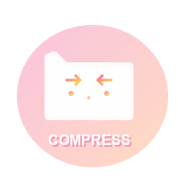
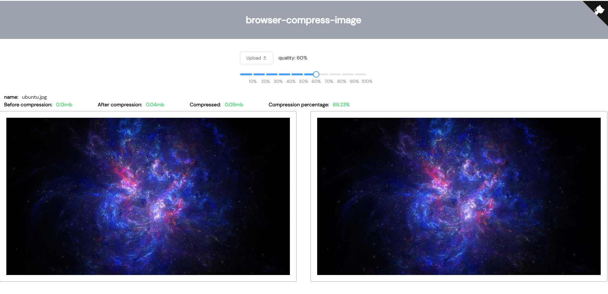

<div align="center">
  
  
  ### Browser Compress Image
</div>

### 🎯 多工具压缩 - 自动选择最优结果

```typescript
import { compress } from '@awesome-compressor/browser-compress-image'

// 返回所有工具结果，查看最优方案和每个工具的表现
const result = await compress(file, {
  quality: 0.8,
  returnAllResults: true,
  type: 'blob',
})

console.log('最优压缩工具:', result.bestTool)
console.log('最优压缩结果:', result.bestResult)
console.log('所有结果:', result.allResults)
```

### 📊 压缩性能统计

```typescript
import { compressWithStats } from '@awesome-compressor/browser-compress-image'

// 获取详细的压缩统计信息，包括耗时和性能数据
const stats = await compressWithStats(file, { quality: 0.8 })

console.log('压缩统计:', {
  bestTool: stats.bestTool, // 最优工具: "canvas"
  originalSize: stats.originalSize, // 原始大小: 1024000 bytes
  compressedSize: stats.compressedSize, // 压缩后大小: 512000 bytes
  compressionRatio: stats.compressionRatio, // 压缩比例: 50%
  totalDuration: stats.totalDuration, // 总耗时: 1200ms
  toolsUsed: stats.toolsUsed, // 各工具详细性能数据
})

// 性能对比表格会在控制台自动显示
// ┌─────────┬──────────────────────┬───────────────┬──────────────┬─────────────┐
// │ (index) │        Tool          │ Size (bytes)  │ Reduction (%)│ Duration    │
// ├─────────┼──────────────────────┼───────────────┼──────────────┼─────────────┤
// │    0    │ 'canvas'             │    512000     │   '50.0%'    │   '800ms'   │
// │    1    │ 'browser-compression'│    520000     │   '49.2%'    │   '1200ms'  │
// └─────────┴──────────────────────┴───────────────┴──────────────┴─────────────┘
```

# 🚀 Browser Compress Image

  <p align="center">
    <strong>轻量级、高性能的浏览器图片压缩库</strong>
  </p>
  
  <p align="center">
    支持多种浏览器图片压缩路径 | 多种输出类型 | 完整 TypeScript 支持
  </p>

  <p align="center">
    <a href="https://www.npmjs.com/package/@awesome-compressor/browser-compress-image"></a>
    <a href="https://www.npmjs.com/package/@awesome-compressor/browser-compress-image"></a>
    <a href="https://github.com/Simon-He95/browser-compress-image"></a>
    <a href="https://github.com/Simon-He95/browser-compress-image/blob/main/LICENSE"></a>
  </p>
</div>

> 当前状态（npm `0.0.4`）：主线程压缩路径、队列管理、预处理和多工具比对可以直接使用；Worker 压缩仍是实验性能力，默认关闭。工具注册 API 主要用于控制运行时启用哪些压缩器，最终打包体积仍取决于你的 bundler 和 tree shaking / code splitting 效果。

## ✨ 特性

### 🎯 核心功能

- **多格式支持** - JPEG、PNG、GIF、WebP 是当前主压缩路径；转换模块还提供现代格式相关能力
- **多输出类型** - Blob、File、Base64、ArrayBuffer 任你选择
- **多工具引擎** - 集成 JSQuash、TinyPNG、CompressorJS、Canvas、browser-image-compression 等多种压缩算法
- **智能优选** - 自动比对多工具压缩结果，选择最优质量与体积的方案
- **WASM 加速** - JSQuash 基于 WebAssembly 的高性能压缩，支持 AVIF、JPEG XL 等现代格式
- **在线压缩** - 支持 TinyPNG 在线压缩服务，获得业界领先的压缩效果
- **工具注册与动态加载** - 可按场景启用压缩工具，并在运行时控制工具集合

### 🚀 上传方式

- **拖拽上传** - 支持单文件/多文件拖拽，PC 和移动端友好
- **粘贴上传** - 直接 Ctrl+V 粘贴图片，快速便捷
- **文件夹上传** - 一键选择文件夹，批量处理图片
- **批量处理** - 同时处理多个图片文件，并行压缩

### 🔧 技术特性

- **打包可观测** - 当前仓库构建会产出一个主入口和若干懒加载 chunk，实际接入体积需要结合你的 bundler 验证
- **TypeScript** - 完整类型支持，开发体验极佳
- **现代化 API** - 简洁易用的 async/await 接口
- **高性能** - 默认推荐队列管理 + 主线程压缩；Worker 路径保留为实验性选项
- **灵活配置** - 自定义压缩质量和输出格式
- **智能过滤** - 根据 EXIF 需求自动选择合适的压缩工具
- **多结果比较** - 支持返回所有工具的压缩结果进行性能分析
- **智能缓存** - LRU 算法缓存压缩结果，避免重复 API 调用
- **工具配置** - 支持为不同压缩工具配置 API 密钥等参数
- **动态加载** - 支持运行时动态加载压缩工具，进一步优化性能

## 🏆 为什么选择我们？

| 特性                   | 我们 | 其他库 |
| ---------------------- | ---- | ------ |
| 多输出格式             | ✅   | ❌     |
| 多工具引擎比对         | ✅   | ❌     |
| JSQuash WASM 压缩      | ✅   | ❌     |
| 现代格式支持           | ✅   | ❌     |
| TinyPNG 在线压缩       | ✅   | ❌     |
| 智能缓存机制           | ✅   | ❌     |
| 工具配置管理           | ✅   | ❌     |
| **工具注册与动态加载** | ✅   | ❌     |
| **运行时工具过滤**     | ✅   | ❌     |
| **动态工具加载**       | ✅   | ❌     |
| TypeScript 支持        | ✅   | 部分   |
| GIF/WebP 压缩          | ✅   | 很少   |
| 批量/粘贴上传          | ✅   | ❌     |
| 文件夹上传             | ✅   | ❌     |
| 零配置使用             | ✅   | ❌     |
| 文档完善               | ✅   | 一般   |

### 📦 打包说明

- 当前发布包会生成一个共享主入口和若干懒加载 chunk。
- `.`、`./tools`、`./conversion`、`./utils` 目前都指向同一个根入口文件。
- `registerCanvas()`、`registerCompressorJS()` 这类 API 的主要价值是控制运行时启用哪些工具；如果你在意 bundle size，请在自己的构建里结合分析器验证实际收益。

## 📦 安装

```bash
# npm
npm install @awesome-compressor/browser-compress-image

# yarn
yarn add @awesome-compressor/browser-compress-image

# pnpm
pnpm add @awesome-compressor/browser-compress-image
```

## 🚀 快速开始

### 两种使用方式

#### 方式一：完整功能（推荐新手）

```typescript
import { compress } from '@awesome-compressor/browser-compress-image'

// 自动加载所有压缩工具，智能选择最优结果
const compressedBlob = await compress(file, 0.6)
console.log('压缩完成！', compressedBlob)
```

#### 方式二：工具注册（适合控制工具集合）

```typescript
import {
  compressWithTools,
  registerCanvas,
  registerCompressorJS,
} from '@awesome-compressor/browser-compress-image'

// 只注册需要的工具，控制运行时使用哪些压缩器
registerCanvas()
registerCompressorJS()

const compressedBlob = await compressWithTools(file, {
  quality: 0.8,
  mode: 'keepSize',
})
```

### 📊 工具组合建议

| 配置方式   | 工具集合              | 适用场景        |
| ---------- | --------------------- | --------------- |
| 基础配置   | Canvas                | 移动端、博客    |
| 平衡配置   | Canvas + CompressorJS | 大多数 Web 应用 |
| 高质量配置 | 上述 + JSQuash        | 图片处理应用    |
| 完整配置   | 所有工具              | 专业图片编辑器  |

### 基础用法示例

```typescript
// 保留 EXIF 信息的压缩
const compressedWithExif = await compress(file, {
  quality: 0.8,
  preserveExif: true,
})

// 指定尺寸压缩
const resizedAndCompressed = await compress(file, {
  quality: 0.7,
  maxWidth: 1920,
  maxHeight: 1080,
})
```

### ⚡ JSQuash WASM 压缩引擎

JSQuash 是基于 WebAssembly 的高性能图片压缩引擎，支持最新的图片格式：

```typescript
// 方式一：完整功能自动加载
import { compress } from '@awesome-compressor/browser-compress-image'

const compressedBlob = await compress(file, {
  quality: 0.8,
  // JSQuash 会自动选择作为首选工具（如果支持该格式）
})

// 方式二：按需导入 JSQuash
import {
  compressWithTools,
  registerJsquash,
} from '@awesome-compressor/browser-compress-image'

registerJsquash() // 只加载 JSQuash 工具
const result = await compressWithTools(file, { quality: 0.8 })

// 检查 JSQuash 可用性和支持的格式
import {
  diagnoseJsquashAvailability,
  configureWasmLoading,
} from '@awesome-compressor/browser-compress-image'

const diagnosis = await diagnoseJsquashAvailability()
console.log('WASM 支持:', diagnosis.wasmSupported)
console.log('可用格式:', diagnosis.availableFormats)
console.log('错误信息:', diagnosis.errors)
```

**JSQuash 特色功能：**

- 🚀 **WASM 加速** - 基于 WebAssembly 的原生性能
- 🎨 **现代格式** - 支持 AVIF、JPEG XL、WebP 等最新格式
- 📦 **零配置** - 自动从 CDN 加载 WASM 模块
- 🔄 **智能回退** - WASM 加载失败时自动使用其他工具
- 💾 **本地缓存** - 支持本地 WASM 文件缓存
- 🎛️ **按需加载** - 只在需要时动态加载，减小打包体积

#### 格式支持矩阵

| 格式    | JSQuash | 其他工具 | 优势                     |
| ------- | ------- | -------- | ------------------------ |
| JPEG    | ✅      | ✅       | 更好的质量/体积比        |
| PNG     | ✅      | ✅       | 更快的处理速度           |
| WebP    | ✅      | 部分     | 原生支持，更好压缩效果   |
| AVIF    | ✅      | ❌       | 独家支持，最佳现代格式   |
| JPEG XL | ✅      | ❌       | 独家支持，次世代压缩标准 |

#### 高级配置

``````typescript
import {
  configureWasmLoading,
  downloadWasmFiles,
} from '@awesome-compressor/browser-compress-image'

// 配置本地 WASM 文件加载
configureWasmLoading({
  useLocal: true,
  baseUrl: '/assets/wasm/', // 本地 WASM 文件路径
})
})

### 📦 工具注册与动态加载

如果你想控制运行时真正参与压缩的工具集合，可以使用注册 API；至于最终 bundle 是否显著变小，需要结合你的 bundler 实测。

#### 快速开始

```typescript
// 1. 基础工具集合 - 适合移动端
import {
  compressWithTools,
  registerCanvas
} from '@awesome-compressor/browser-compress-image'

registerCanvas()
const result = await compressWithTools(file, { quality: 0.8 })
```

```typescript
// 2. 平衡工具集合 - 适合大多数 Web 应用
import {
  compressWithTools,
  registerCanvas,
  registerCompressorJS,
} from '@awesome-compressor/browser-compress-image'

registerCanvas()
registerCompressorJS()
const result = await compressWithTools(file, { quality: 0.8 })
```

```typescript
// 3. 高质量工具集合 - 适合图片处理应用
import {
  compressWithTools,
  registerCanvas,
  registerCompressorJS,
  registerJsquash,
} from '@awesome-compressor/browser-compress-image'

registerCanvas()
registerCompressorJS()
registerJsquash()
const result = await compressWithTools(file, { quality: 0.9 })
```

#### 动态加载策略

根据实际需求动态加载压缩工具，进一步优化性能：

```typescript
import { compressWithTools } from '@awesome-compressor/browser-compress-image'

async function smartCompress(file: File) {
  // 根据文件类型动态加载最合适的工具
  if (file.type.includes('jpeg')) {
    const { registerCompressorJS } = await import(
      '@awesome-compressor/browser-compress-image'
    )
    registerCompressorJS()
  } else if (file.type.includes('gif')) {
    const { registerGifsicle } = await import(
      '@awesome-compressor/browser-compress-image'
    )
    registerGifsicle()
  } else {
    const { registerCanvas } = await import(
      '@awesome-compressor/browser-compress-image'
    )
    registerCanvas()
  }

  return compressWithTools(file, { quality: 0.8 })
}
```

#### 自定义工具注册表

创建独立的压缩实例，完全控制工具配置：

```typescript
import {
  ToolRegistry,
  compressWithTools,
  compressWithCanvas,
  compressWithCompressorJS,
} from '@awesome-compressor/browser-compress-image'

// 创建自定义工具注册表
const customRegistry = new ToolRegistry()
customRegistry.registerTool('canvas', compressWithCanvas)
customRegistry.registerTool('compressorjs', compressWithCompressorJS)

// 设置工具优先级
customRegistry.setToolPriority('jpeg', ['compressorjs', 'canvas'])
customRegistry.setToolPriority('png', ['canvas'])

// 使用自定义注册表
const result = await compressWithTools(file, {
  quality: 0.8,
  toolRegistry: customRegistry,
})
```

#### 可用的注册函数

| 函数                                | 典型用途    | 支持格式      | 特点                     |
| ----------------------------------- | ----------- | ------------- | ------------------------ |
| `registerCanvas()`                  | 基础压缩    | JPEG/PNG/WebP | 浏览器原生，兼容性最好   |
| `registerCompressorJS()`            | JPEG 优化   | JPEG          | JPEG 专用，压缩效果优秀  |
| `registerBrowserImageCompression()` | 通用压缩    | 全格式        | 功能全面，配置灵活       |
| `registerJsquash()`                 | 现代格式实验 | 现代格式      | WASM 加速，支持 AVIF/JXL |
| `registerGifsicle()`                | GIF 优化    | GIF           | GIF 专用优化工具         |
| `registerTinyPng()`                 | 在线压缩    | PNG/JPEG/WebP | 在线服务，需要 API Key   |
| `registerAllTools()`                | 全量工具集  | 全格式        | 所有工具，功能最全       |

更多详细信息请参考 [按需导入指南](./docs/tree-shaking-guide.md)

### 🎯 使用场景建议

根据不同的应用场景，我们推荐不同的配置策略：

#### 📱 移动端 Web 应用

```typescript
// 最小工具集合，路径最简单
import {
  compressWithTools,
  registerCanvas,
} from '@awesome-compressor/browser-compress-image'

registerCanvas()
const result = await compressWithTools(file, { quality: 0.7 })
```

**优势**: 工具集合最小，加载路径简单，电池友好

#### 🌐 企业官网/博客

```typescript
// 基础配置，平衡功能和体积
import {
  compressWithTools,
  registerCanvas,
  registerCompressorJS,
} from '@awesome-compressor/browser-compress-image'

registerCanvas()
registerCompressorJS()
const result = await compressWithTools(file, { quality: 0.8 })
```

**优势**: JPEG 效果好，功能够用

#### 🛒 电商/内容平台

```typescript
// 高质量配置，追求最佳压缩效果
import {
  compressWithTools,
  registerCanvas,
  registerCompressorJS,
  registerJsquash,
} from '@awesome-compressor/browser-compress-image'

registerCanvas()
registerCompressorJS()
registerJsquash()
const result = await compressWithTools(file, { quality: 0.9 })
```

**优势**: 约 150KB，支持现代格式，压缩质量最佳

#### 🎨 图片编辑器/专业工具

```typescript
// 完整配置，功能最全
import {
  registerAllTools,
  compress,
} from '@awesome-compressor/browser-compress-image'

registerAllTools()
const result = await compress(file, {
  quality: 0.9,
  toolConfigs: [{ name: 'tinypng', key: 'your-api-key' }],
})
```

**优势**: 所有功能，专业级体验

#### ⚡ 动态加载（推荐）

```typescript
// 智能按需加载，最优策略
async function smartCompress(file: File) {
  if (file.type.includes('jpeg')) {
    const { registerCompressorJS } = await import(
      '@awesome-compressor/browser-compress-image'
    )
    registerCompressorJS()
  } else {
    const { registerCanvas } = await import(
      '@awesome-compressor/browser-compress-image'
    )
    registerCanvas()
  }
  return compressWithTools(file, { quality: 0.8 })
}
```

**优势**: 按需加载，体积和功能的完美平衡

### 🌐 TinyPNG 在线压缩服务

使用 TinyPNG 的在线压缩服务，获得业界领先的压缩效果：

```typescript
import { compress } from '@awesome-compressor/browser-compress-image'

// 使用 TinyPNG 压缩（需要 API 密钥）
const compressedBlob = await compress(file, {
  quality: 0.8,
  toolConfigs: [
    {
      name: 'tinypng',
      key: 'your-tinypng-api-key', // 从 https://tinypng.com/developers 获取
      enabled: true,
    },
  ],
})

// TinyPNG 支持尺寸调整
const resizedAndCompressed = await compress(file, {
  mode: 'keepQuality',
  targetWidth: 800,
  targetHeight: 600,
  toolConfigs: [
    {
      name: 'tinypng',
      key: 'your-api-key',
      enabled: true,
    },
  ],
})
```

**TinyPNG 特色功能：**

- 🎯 **智能压缩** - AI 算法优化，保持最佳视觉质量
- 📐 **尺寸调整** - 在压缩的同时调整图片尺寸
- 🌍 **格式支持** - JPEG、PNG、WebP 全覆盖
- 💾 **缓存优化** - 自动缓存相同文件的压缩结果，节省 API 配额
- 🆓 **免费额度** - 每月 500 次免费压缩

#### 缓存管理

TinyPNG 压缩结果会自动缓存，避免重复 API 调用：

```typescript
import {
  clearTinyPngCache,
  getTinyPngCacheInfo,
  configureTinyPngCache,
} from '@awesome-compressor/browser-compress-image'

// 查看缓存状态
const cacheInfo = getTinyPngCacheInfo()
console.log(`缓存使用率: ${cacheInfo.usageRate.toFixed(1)}%`)
console.log(`已缓存文件: ${cacheInfo.totalEntries}/${cacheInfo.maxSize}`)

// 配置缓存大小（默认 50 个文件）
configureTinyPngCache(100) // 增加到 100 个文件

// 清空缓存
clearTinyPngCache()
```

### 🎯 多工具压缩 - 自动选择最优结果

```typescript
import { compress } from '@awesome-compressor/browser-compress-image'

// 默认行为：自动选择最优结果
const compressedBlob = await compress(file, {
  quality: 0.8,
  preserveExif: true,
})

// 获取所有工具的压缩结果进行比较
const allResults = await compress(file, {
  quality: 0.8,
  returnAllResults: true, // 返回所有工具的结果
  type: 'blob',
})

console.log('最优工具:', allResults.bestTool)
console.log('最优结果:', allResults.bestResult)
console.log('所有结果:')
allResults.allResults.forEach((result) => {
  console.log(
    `${result.tool}: ${result.compressedSize} bytes (${result.compressionRatio.toFixed(1)}% reduction)`,
  )
})
```

### 📁 多文件批量处理

```typescript
// 批量压缩多个文件
const files = Array.from(fileInput.files)
const compressedFiles = await Promise.all(
  files.map((file) => compress(file, 0.7, 'file')),
)
```

### 📋 粘贴上传

```typescript
// 监听粘贴事件
document.addEventListener('paste', async (e) => {
  const items = Array.from(e.clipboardData?.items || [])
  const imageItems = items.filter((item) => item.type.startsWith('image/'))

  for (const item of imageItems) {
    const file = item.getAsFile()
    if (file) {
      const compressed = await compress(file, 0.6)
      // 处理压缩后的图片
    }
  }
})
```

### 📂 文件夹上传

`````html
<!-- HTML 中设置 webkitdirectory 属性 -->
<input
  type="file"
  webkitdirectory
  multiple
  accept="image/*"
  @change="handleFolderUpload"
/>
````typescript const handleFolderUpload = async (event: Event) => { const files
= Array.from((event.target as HTMLInputElement).files || []) const imageFiles =
files.filter(file => file.type.startsWith('image/')) //
批量压缩文件夹中的所有图片 const results = await Promise.all(
imageFiles.map(async file => ({ original: file, compressed: await compress(file,
0.7, 'file'), path: file.webkitRelativePath })) ) } ### 🎨 多种输出格式
```typescript // 🔹 返回 Blob (默认) const blob = await compress(file, 0.6,
'blob') // 🔹 返回 File 对象，保留文件名 const file = await
compress(originalFile, 0.6, 'file') // 🔹 返回 Base64 字符串，直接用于 img src
const base64 = await compress(file, 0.6, 'base64') // 🔹 返回
ArrayBuffer，用于进一步处理 const arrayBuffer = await compress(file, 0.6,
'arrayBuffer')
``````

### 🎯 实际应用场景

#### 📸 上传前压缩

```typescript
const handleUpload = async (file: File) => {
  // 压缩为 File 对象，保留原文件名
  const compressedFile = await compress(file, 0.7, 'file')

  const formData = new FormData()
  formData.append('image', compressedFile)

  await fetch('/api/upload', {
    method: 'POST',
    body: formData,
  })
}
```

#### 🖼️ 图片预览

```typescript
const showPreview = async (file: File) => {
  // 压缩为 Base64，直接显示
  const base64 = await compress(file, 0.6, 'base64')

  const img = document.createElement('img')
  img.src = base64
  document.body.appendChild(img)
}
```

#### 💾 数据处理

```typescript
const processImageData = async (file: File) => {
  // 压缩为 ArrayBuffer，进行二进制处理
  const buffer = await compress(file, 0.8, 'arrayBuffer')

  // 发送到 WebSocket 或进行其他二进制操作
  websocket.send(buffer)
}
```

## 📚 API 文档

### compress 函数

```typescript
compress<T extends CompressResultType = 'blob'>(
  file: File,          // 要压缩的图片文件
  quality?: number,    // 压缩质量 (0-1)，默认 0.6
  type?: T            // 输出格式，默认 'blob'
): Promise<CompressResult<T>>
```

### compressWithStats 函数

```typescript
compressWithStats(
  file: File,                    // 要压缩的图片文件
  options?: CompressOptions      // 压缩选项（可选）
): Promise<CompressionStats>
```

返回详细的压缩统计信息，包括：

```typescript
interface CompressionStats {
  bestTool: string // 最优压缩工具名称
  compressedFile: Blob // 最优压缩结果
```

---

## 📝 日志与调试

库内部使用一个小型可配置的 logger，默认是静默的（production friendly）。你可以按三种方式来打开或定制日志：

- 通过环境变量在打包或测试时开启：
  - 设置 `DEBUG_BROWSER_COMPRESS_IMAGE=true` 或在开发环境下 `NODE_ENV=development`，默认会启用日志。

- 在运行时启用默认 logger：

```typescript
import { logger } from '@awesome-compressor/browser-compress-image'

// 打开日志
logger.enable()

// 关闭日志
logger.disable()
```

- 注入自定义 logger（例如转发到你的应用日志系统或远程收集）：

```typescript
import {
  setLogger,
  resetLogger,
  logger,
} from '@awesome-compressor/browser-compress-image'

// 自定义 logger 实现（只需实现需要的方法）
const custom = {
  enabled: true,
  log: (...args: any[]) => myAppLogger.info(...args),
  warn: (...args: any[]) => myAppLogger.warn(...args),
  error: (...args: any[]) => myAppLogger.error(...args),
}

setLogger(custom)

// 使用库时，日志会交由 custom 处理
logger.log('this will go to myAppLogger')

// 恢复默认实现
resetLogger()
```

这使你可以在开发或调试时打开详细日志，同时在生产发布时保持控制台清洁。
originalSize: number // 原始文件大小（字节）
compressedSize: number // 压缩后大小（字节）
compressionRatio: number // 压缩比例（百分比）
totalDuration: number // 总耗时（毫秒）
toolsUsed: Array<{
// 各工具详细信息
tool: string // 工具名称
size: number // 压缩后大小
duration: number // 耗时
compressionRatio: number // 压缩比例
success: boolean // 是否成功
error?: string // 错误信息（如果失败）
}>
}

````

#### 🛠️ 支持的压缩工具

| 工具                      | 标识符                        | 适用格式                   | EXIF支持 | 特点                     |
| ------------------------- | ----------------------------- | -------------------------- | -------- | ------------------------ |
| JSQuash                   | `'jsquash'`                   | JPEG, PNG, WebP, AVIF, JXL | ❌       | WASM 加速，现代格式支持  |
| Browser Image Compression | `'browser-image-compression'` | JPEG, PNG                  | ✅       | 快速压缩，兼容性好       |
| CompressorJS              | `'compressorjs'`              | JPEG, PNG                  | ⚠️       | 轻量级，配置灵活         |
| Canvas                    | `'canvas'`                    | 所有格式                   | ❌       | 原生浏览器 API，通用性强 |
| Gifsicle                  | `'gifsicle'`                  | GIF                        | N/A      | GIF 专用压缩引擎         |
| TinyPNG                   | `'tinypng'`                   | JPEG, PNG, WebP            | ✅       | 在线压缩服务，效果卓越   |

**EXIF 支持说明：**

- ✅ 完全支持：可以完整保留 EXIF 信息
- ⚠️ 部分支持：可以保留基本信息，但可能会丢失某些元数据
- ❌ 不支持：压缩过程会移除所有 EXIF 信息
- N/A 不适用：该格式通常不包含 EXIF 信息

### 📸 EXIF 信息处理

当设置 `preserveExif: true` 时，库会自动进行智能工具过滤：

| 工具                      | EXIF 支持 | 说明                   |
| ------------------------- | --------- | ---------------------- |
| browser-image-compression | ✅        | 原生支持 EXIF 保留     |
| CompressorJS              | ✅        | 支持 EXIF 保留         |
| TinyPNG                   | ✅        | 支持 EXIF 保留         |
| JSQuash                   | ❌        | 不支持（会被自动过滤） |
| Canvas                    | ❌        | 不支持（会被自动过滤） |
| gifsicle                  | ❌        | 不支持（会被自动过滤） |

**智能过滤机制**：

- 当 `preserveExif: true` 时，系统自动过滤掉 JSQuash、Canvas 和 gifsicle 工具
- 确保只使用支持 EXIF 保留的工具进行压缩
- 如果没有可用的 EXIF 支持工具，会抛出错误提示用户调整参数

```typescript
// EXIF 信息会被保留，只使用 browser-image-compression 和 CompressorJS
const result = await compress(file, {
  quality: 0.8,
  preserveExif: true, // 自动过滤不支持 EXIF 的工具
})

// 注意：GIF 格式不支持 EXIF，会抛出错误
try {
  const gifResult = await compress(gifFile, {
    preserveExif: true, // ❌ 会抛出错误
  })
} catch (error) {
  console.error('GIF files do not support EXIF preservation')
}
````

#### 🖼️ 支持的图片格式

- **JPEG** (.jpg, .jpeg) - 使用 JSQuash、browser-image-compression、CompressorJS、Canvas、TinyPNG
- **PNG** (.png) - 使用 JSQuash、browser-image-compression、CompressorJS、Canvas、TinyPNG
- **WebP** (.webp) - 使用 JSQuash、Canvas、TinyPNG
- **AVIF** (.avif) - 使用 JSQuash（独家支持）
- **JPEG XL** (.jxl) - 使用 JSQuash（独家支持）
- **GIF** (.gif) - 使用 gifsicle-wasm-browser
- **其他格式** - 使用 Canvas 和 CompressorJS 兜底

### 🔍 多工具结果比较

当设置 `returnAllResults: true` 时，可以获取所有压缩工具的详细结果：

```typescript
interface MultipleCompressResults<T> {
  bestResult: CompressResult<T> // 最优结果（文件大小最小）
  bestTool: string // 最优工具名称
  allResults: CompressResultItem<T>[] // 所有工具的结果
  totalDuration: number // 总耗时（毫秒）
}

interface CompressResultItem<T> {
  tool: string // 工具名称
  result: CompressResult<T> // 压缩结果
  originalSize: number // 原始大小
  compressedSize: number // 压缩后大小
  compressionRatio: number // 压缩比例（百分比）
  duration: number // 耗时（毫秒）
  success: boolean // 是否成功
  error?: string // 错误信息（如果失败）
}

// 使用示例
const results = await compress(file, {
  quality: 0.8,
  returnAllResults: true,
  type: 'blob',
})

// 分析所有工具的性能
results.allResults.forEach((item) => {
  console.log(
    `${item.tool}: ${item.compressedSize} bytes, ${item.compressionRatio.toFixed(1)}% reduction, ${item.duration}ms`,
  )
})

// 使用最优结果
const optimizedFile = results.bestResult
```

**使用场景：**

- 🔬 **性能分析** - 比较不同工具在特定图片上的表现
- 📊 **数据收集** - 收集压缩统计数据用于优化
- 🎯 **自定义选择** - 根据特定需求（如速度优先）选择合适工具
- 🔍 **调试诊断** - 分析压缩失败的原因

#### 📋 参数说明

| 参数               | 类型                 | 默认值   | 说明                                 |
| ------------------ | -------------------- | -------- | ------------------------------------ |
| `file`             | `File`               | -        | 要压缩的图片文件                     |
| `quality`          | `number`             | `0.6`    | 压缩质量，范围 0-1，值越小文件越小   |
| `type`             | `CompressResultType` | `'blob'` | 输出格式类型                         |
| `preserveExif`     | `boolean`            | `false`  | 是否保留 EXIF 信息（仅部分工具支持） |
| `returnAllResults` | `boolean`            | `false`  | 是否返回所有工具的压缩结果           |
| `toolConfigs`      | `ToolConfig[]`       | `[]`     | 工具配置数组，用于配置 API 密钥等    |

#### 🔧 工具配置接口

```typescript
interface ToolConfig {
  name: string // 工具名称，如 'tinypng'
  key: string // API 密钥或配置参数
  enabled: boolean // 是否启用此工具
}

// 使用示例
const toolConfigs: ToolConfig[] = [
  {
    name: 'tinypng',
    key: 'your-tinypng-api-key',
    enabled: true,
  },
]

const result = await compress(file, {
  quality: 0.8,
  toolConfigs,
})
```

#### 🎯 支持的输出格式

| 格式            | 类型          | 说明                 | 使用场景            |
| --------------- | ------------- | -------------------- | ------------------- |
| `'blob'`        | `Blob`        | 二进制对象           | 文件上传、存储      |
| `'file'`        | `File`        | 文件对象，保留文件名 | 表单提交、文件系统  |
| `'base64'`      | `string`      | Base64 编码字符串    | 图片显示、数据传输  |
| `'arrayBuffer'` | `ArrayBuffer` | 二进制数据缓冲区     | WebSocket、底层处理 |

### 🎨 UI 交互功能

#### 📱 移动端和桌面端优化

- **智能拖拽** - 拖拽时自动隐藏信息层，提升视觉体验
- **响应式设计** - 完美适配各种屏幕尺寸
- **触摸友好** - 移动端手势操作优化

#### 📊 压缩统计显示

- **实时统计** - 显示原始大小、压缩后大小、节省空间
- **压缩比例** - 负数用红色显示，正数用绿色显示
- **批量统计** - 多文件压缩时显示总体统计信息

### TypeScript 类型支持

```typescript
import type {
  CompressResultType,
  CompressResult,
} from '@awesome-compressor/browser-compress-image'

// 类型会根据第三个参数自动推断
const blob = await compress(file, 0.6, 'blob') // 类型: Blob
const file2 = await compress(file, 0.6, 'file') // 类型: File
const base64 = await compress(file, 0.6, 'base64') // 类型: string
const buffer = await compress(file, 0.6, 'arrayBuffer') // 类型: ArrayBuffer
```

## 📊 压缩效果对比

<div align="center">
  
</div>

## 🤝 贡献

我们欢迎任何形式的贡献！

1. Fork 这个项目
2. 创建你的特性分支 (`git checkout -b feature/AmazingFeature`)
3. 提交你的更改 (`git commit -m 'Add some AmazingFeature'`)
4. 推送到分支 (`git push origin feature/AmazingFeature`)
5. 打开一个 Pull Request

## 🙏 致谢

本项目基于以下优秀的开源库构建：

- **核心压缩引擎**
  - [browser-image-compression](https://github.com/Donaldcwl/browser-image-compression) - 浏览器图片压缩核心
  - [compressorjs](https://github.com/fengyuanchen/compressorjs) - 轻量级图片压缩库
  - [gifsicle-wasm-browser](https://github.com/renzhezhilu/gifsicle-wasm-browser) - GIF 专用压缩支持
  - [TinyPNG API](https://tinypng.com/developers) - 在线智能压缩服务

- **性能优化**
  - 自主实现的 LRU 缓存算法 - 优化重复压缩请求，提升性能

- **开发工具**
  - [Vue 3](https://vuejs.org/) - 渐进式 JavaScript 框架
  - [Vite](https://vitejs.dev/) - 现代化构建工具
  - [TypeScript](https://www.typescriptlang.org/) - 类型安全的 JavaScript

## 📌 当前状态

### npm 当前版本：v0.0.4

- `compress`、`compressWithTools`、`compressEnhanced` 的主线程路径可以直接使用。
- `compressEnhanced` 默认推荐队列管理；Worker 压缩仍是实验性能力，默认关闭。
- `compress(file, { returnAllResults: true })` 和 `compressWithStats` 可以用于多工具结果分析。
- `ToolRegistry`、`registerCanvas()`、`registerCompressorJS()` 等 API 已可用，但它们更适合控制运行时工具集合，而不是在文档层面承诺固定 bundle size。
- JSQuash 应被视为浏览器环境下的 WASM / 现代格式能力；在非浏览器环境中会显式失败并交给其他工具回退。

> 升级建议：如果你只是想接入稳定压缩路径，优先使用 `compress` 或默认配置下的 `compressEnhanced`。如果你需要精细控制工具集合，再引入 `compressWithTools` / `ToolRegistry`，并在自己的构建中验证真实体积收益。

## 📄 许可证

[MIT](./LICENSE) License © 2022-2025 [Simon He](https://github.com/Simon-He95)

---

<div align="center">
  <p>如果这个项目对你有帮助，请给个 ⭐️ 支持一下！</p>
  <p>Made with ❤️ by <a href="https://github.com/Simon-He95">Simon He</a></p>
</div>
